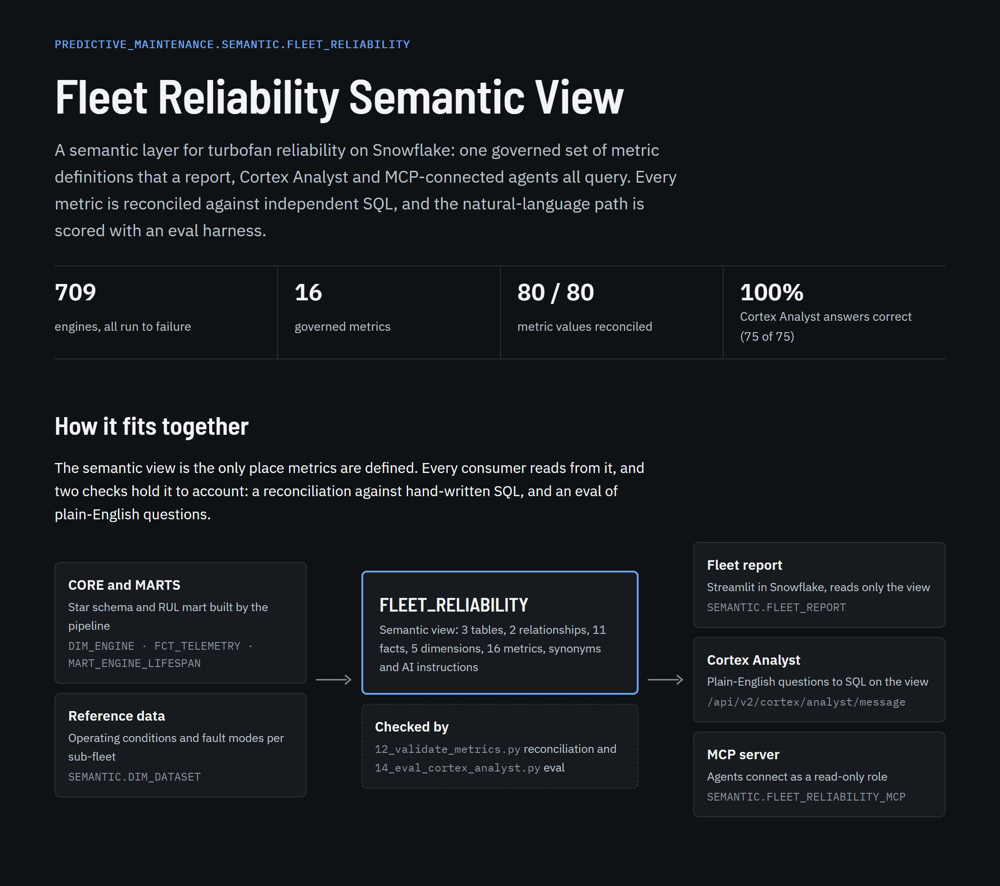

# Definition-Driven Predictive Maintenance Pipeline

An end-to-end data engineering and machine learning feature store built on Snowflake. This project demonstrates how to process raw aerospace telemetry data into mathematically transformed, ML-ready features for predictive maintenance.

## Business Objective
Unexpected hardware failure in aviation and heavy industry carries catastrophic costs. This pipeline ingests run-to-failure sensor data from the NASA CMAPSS (Turbofan Engine Degradation) dataset and builds a foundation for **Condition-Based Maintenance**.

By calculating rolling window metrics and defining a Piecewise Remaining Useful Life (RUL) target variable, this architecture allows machine learning models to accurately predict failures before they happen, minimizing unplanned downtime and optimizing supply chain logistics.

## The 5-Schema Snowflake Architecture
This project implements a rigorous, definition-driven data platform decoupled into five distinct layers:

1. **RAW:** Ingestion of flat, space-delimited text logs directly from the internal stage.
2. **STAGING:** Type-casting, standardizing arbitrary column names to physical engine components (e.g., High-Pressure Compressor Temperature), and building a dataset-aware engine key (`FD002_001`), since engine numbers restart in each of the four source files.
3. **CORE:** Relational modeling (Star Schema) splitting static entities (`DIM_ENGINE`) from time-series events (`FCT_TELEMETRY`).
4. **MARTS:** Application of business logic to calculate the target variable: a piecewise-capped Remaining Useful Life (RUL) to prevent overfitting on healthy engines.
5. **FEATURE STORE:** Push-down compute utilizing SQL Window Functions to generate 5-cycle rolling moving averages and standard deviations, dramatically increasing the signal-to-noise ratio for downstream ML models.

## Machine Learning: Tandem Binary Classifiers
To operationalize the feature store, this project includes a complete modeling workflow utilizing Snowpark and XGBoost:

* **Dual-Model Strategy:** Deploys a tandem approach predicting both an *Early Warning* (≤50 cycles) and *Critical Action* (≤15 cycles) state to drive specific maintenance protocols.
* **F2-Optimized Thresholds:** Prioritizes recall to minimize costly missed failures, leveraging the F-beta score (beta=2) to dynamically tune decision thresholds.
* **Honest Evaluation:** Engines are split 60/20/20 into train, validation, and test sets. Thresholds and strategies are chosen on validation engines; test engines are scored once.
* **Class Imbalance Experimentation:** Compares manual SMOTE, 6x undersampling, and `scale_pos_weight`. All three land within about 0.01 F2, so the simplest option (`scale_pos_weight`) is preferred.
* **Model Registry:** Demonstrates MLOps best practices by versioning and logging champion models directly into Snowflake's native ML Registry.

### Results (held-out test engines)

| Model | Recall | Precision | F2 |
|-------|--------|-----------|----|
| Early Warning (≤ 50 cycles) | 0.917 | 0.679 | 0.857 |
| Critical Action (≤ 15 cycles) | 0.908 | 0.636 | 0.837 |

**[Full experiment results](results.md)**


## Reliability Analysis: Weibull Fleet Model

The classifiers decide *which engine* to pull. **[09_weibull_reliability_analysis.ipynb](09_weibull_reliability_analysis.ipynb)** answers the fleet-planning questions: how long engines last, how failure risk grows with age, and when monitoring must be in place.

* **Wear-out failure:** Weibull shape β = 2.9–4.4 across datasets (β > 1 means risk rises with age). Characteristic life η ≈ 225 cycles (one fault mode) and ≈ 274 cycles (two fault modes); B10 life ≈ 135–140 cycles.
* **Fault modes matter, operating conditions don't:** log-rank tests show no lifetime difference across 1 vs. 6 operating conditions (p = 0.73–0.87), but engines with two fault modes live longer and less predictably (p < 0.001), so the fleet is planned as two populations.
* **Failure-free period:** no engine fails before about 125 cycles. A three-parameter Weibull captures this (AIC about 100 points lower) and shows a more gradual wear-out phase beyond it (β ≈ 1.6–1.8).
* **Censoring trap:** treating the truncated test engines as ordinary censored data overstates characteristic life by **5–15%**, because each trajectory was cut off at a random fraction of that engine's own life (censoring age correlates 0.56–0.88 with true life). A simulation confirms the mechanism: unbiased under independent censoring, biased when censoring tracks lifetime.
* **Age vs. sensors:** age alone flags engines within 50 cycles of failure with AUC 0.72–0.86 and misses remaining life by 33–55 cycles on average, which is why sensor-based condition monitoring drives individual removals and Weibull sets the fleet-level window.

## Semantic Layer: Governed Fleet Metrics

**[Take the tour of the Fleet Reliability semantic layer →](https://claude.ai/artifact/Ai1U6EospZRsTgpSU9TxBL#tour)** A 10-step guided walk-through of the model, metrics, validation, Cortex Analyst eval and MCP server.

[](https://claude.ai/artifact/Ai1U6EospZRsTgpSU9TxBL)

**[11_build_semantic_view.py](11_build_semantic_view.py)** adds a `SEMANTIC` schema with a Snowflake semantic view, `FLEET_RELIABILITY`, so BI tools, Cortex Analyst and agents all read the same metric definitions instead of each re-deriving "mean time to failure" in their own SQL.

* **Three grains:** datasets (operating conditions and fault modes from NASA's readme), engines (one row per engine with its failure cycle), and cycles (`MART_ENGINE_LIFESPAN`). Each metric aggregates at its own grain, so engine counts never fan out to telemetry row counts.
* **Metrics:** engine count, mean/median/min/max time to failure and its spread, cycles flown, share of cycles in the early-warning and critical windows, average sensor readings, and HPC/LPT temperature rise from the first 20 cycles to the critical window.
* **Business logic from the existing models:** the `health_stage` dimension uses the classifiers' horizons (RUL ≤ 50 early warning, ≤ 15 critical action), so a question asked in plain English uses the same definitions as the deployed models.
* **Context for natural-language queries:** synonyms (MTTF, T30, failure mode), descriptions with units, and SQL-generation instructions warning that raw sensor levels are not comparable across operating conditions.

| Operating conditions | Fault modes | Engines | MTTF (cycles) | Shortest life | HPC temp rise (°R) |
|---|---|---|---|---|---|
| Single | HPC | 100 | 206.3 | 128 | 13.7 |
| Single | HPC + fan | 100 | 247.2 | 145 | 15.6 |
| Six | HPC | 260 | 206.8 | 128 | 11.7 |
| Six | HPC + fan | 249 | 246.0 | 128 | 7.9 |

MTTF splits by fault mode, not by operating conditions, matching the Weibull log-rank results above.

**Checked, reported and served to agents:**
* **Reconciliation:** [12_validate_metrics.py](12_validate_metrics.py) recomputes every metric with hand-written SQL on STAGING, below anything the view reads. All 80 values (16 metrics × fleet and 4 datasets) match, a deliberate one-cycle threshold error is caught, and a Weibull fit lands within 0.6% of the view's MTTF. Exits non-zero on any mismatch.
* **Report:** [streamlit_app/fleet_report.py](streamlit_app/fleet_report.py) is a Streamlit in Snowflake app that reads only from the view. [13_deploy_fleet_report.py](13_deploy_fleet_report.py) runs every app query, filtered and unfiltered, before deploying.
* **Cortex Analyst eval:** [14_eval_cortex_analyst.py](14_eval_cortex_analyst.py) asks 25 questions 3 times each and scores the returned rows against independent SQL: 75/75 correct. The first pass found a real modeling flaw: a filter value of `'Single (sea level)'` that the model queried as `'Single'`. The fix went into the view. Details in [results.md](results.md).
* **MCP server:** [15_create_mcp_server.py](15_create_mcp_server.py) creates a Snowflake-managed MCP server (Cortex Analyst on the view, plus SQL execution) and a read-only `FLEET_READER` role for clients. The test asks a question over MCP, runs the returned SQL, and confirms that a write through the SQL tool is refused.
* **Public demo, "Ask the Fleet":** [public_app/app.py](public_app/app.py) is a Streamlit Community Cloud app where anyone can ask the fleet questions in plain English and get answers from Cortex Analyst, plus the filterable fleet report. [16_setup_public_demo.py](16_setup_public_demo.py) creates what it runs on: a key-only service user, a read-only role, an extra-small warehouse with a 30-second query limit and a monthly credit cap, and a question log that enforces 50 questions a day (10 per visitor). Generated SQL is only run if it is a single read with no AI or system functions.

## Graph Neural Network: Sensors as a Graph

**[10_sensor_graph_gnn.py](10_sensor_graph_gnn.py)** treats each engine snapshot as a graph. The 14 informative sensors are nodes, each carrying its last 30 cycles of readings, normalized within its operating condition. A GRU encodes each sensor's history, two GATv2 attention layers pass messages between sensors, and a multitask head predicts RUL plus both maintenance flags. Same engine splits, same validation-tuned F2 thresholds, test engines scored once.

**Graph design.** Four edge sets, so the graph itself is tested rather than assumed:
* **Physics:** sensors on the same component, on adjacent gas-path stages (fan → LPC → HPC → combustor → HPT → LPT), on the same shaft, or linked by bleed flows
* **Correlation:** each sensor linked to its 3 most correlated sensors on training engines
* **Full:** every pair linked; attention must find the structure
* **None:** self-loops only, so no message passing (ablation)

### Results (held-out test engines; GNN rows are mean ± std over 3 seeds)

| Model | Early Warning F2 | Critical Action F2 | RUL RMSE (cycles) |
|-------|------------------|--------------------|-------------------|
| XGBoost, original 8 features | 0.857 | 0.837 | n/a |
| XGBoost, same inputs as GNN (flattened) | **0.931** | 0.929 | **14.24** |
| GNN, no edges | 0.930 ± 0.002 | 0.933 ± 0.000 | 14.93 ± 0.10 |
| GNN, correlation graph | **0.931** ± 0.001 | 0.934 ± 0.001 | 14.37 ± 0.16 |
| GNN, physics graph | 0.930 ± 0.002 | 0.934 ± 0.002 | 14.30 ± 0.30 |
| GNN, fully connected | 0.929 ± 0.003 | **0.936** ± 0.003 | 14.61 ± 0.21 |

**Findings**

* **Better inputs did most of the work.** Normalizing sensors within each operating condition, using 14 sensors instead of 3, and giving the model 30 cycles of history lifts XGBoost from 0.857 to 0.931 F2 (Early Warning) and from 0.837 to 0.929 (Critical Action), with no deep learning at all.
* **The GNN ties a strong XGBoost; it does not beat it.** On identical inputs, the GNN matches Early Warning F2 and edges Critical Action by about 0.005 F2, trading some precision (0.79 vs 0.81) for recall (0.98 vs 0.96). RUL error is the same within noise (14.30 vs 14.24).
* **Message passing helps, if the graph is sparse.** Within the GNN, the correlation and physics graphs cut RUL error by about 0.6 cycles versus no edges, and every seed with a sparse graph beat every seed without one. The fully connected graph recovers only half of that gain. Physics and correlation graphs are tied within seed noise, so domain knowledge reproduced what the data already shows rather than adding to it.
* **Recommendation:** keep XGBoost (on the improved inputs) in production. It matches the GNN, trains in seconds rather than 10–15 minutes per run on CPU, and is easier to explain to maintenance engineers. A GNN would earn its complexity where the graph varies: fleets with different sensor sets per engine type, or localizing which component is failing.

**What attention learned.** As engines approach failure (RUL ≤ 15 vs. healthy), the physics GNN shifts attention toward two sensors as message sources: HPC static pressure (Ps30 → bleed enthalpy rises from 0.24 to 0.35; Ps30 → fuel flow ratio and HPC outlet temperature also rise) and LPT outlet temperature (T50 → fan speeds and coolant bleeds, 0.31–0.36 to 0.40–0.45). Both track high-pressure compressor degradation, the fault mode present in all four datasets. Attention weights indicate where the model looks, not proof of cause.

**NASA benchmark.** RMSE (cycles) on the official test trajectories, scored at each engine's last cycle against true RUL capped at 130. One model is trained on all four datasets pooled (425 engines), not tuned per dataset, and the official test set was never used for any choice.

| Model | FD001 | FD002 | FD003 | FD004 |
|-------|-------|-------|-------|-------|
| XGBoost, same inputs | **13.2** | **14.6** | 15.7 | 15.9 |
| GNN, no edges | 14.3 | 15.1 | 15.1 | 16.1 |
| GNN, physics graph | 14.8 | 15.1 | **14.8** | 15.3 |
| GNN, correlation graph | 14.8 | 15.3 | 15.2 | **15.2** |

[Raw results for every seed](gnn_results.json), including recall, precision, PR-AUC, thresholds and the NASA asymmetric score.

## Run It

```bash
pip install -r requirements.txt
python 01_fetch_data.py       # Download NASA C-MAPSS into data/raw
python evaluate_local.py      # Reproduce the feature store and models locally (no Snowflake needed)
jupyter notebook 09_weibull_reliability_analysis.ipynb   # Fleet reliability analysis
python 10_sensor_graph_gnn.py # GNN vs. XGBoost ablation (about 2.5 hours on 8 CPU cores; --quick for a 10-minute check)
pytest tests                  # Unit tests for windows, graphs and batching
```

To run the full Snowflake pipeline, set up [key-pair authentication](https://docs.snowflake.com/en/user-guide/key-pair-auth) and add your Snowflake account details (with `SNOWFLAKE_PRIVATE_KEY_FILE` pointing at your private key) to a `.env` file and run scripts `02` through `07` in order, then the `08` notebook in Snowflake. Then build and check the semantic layer with scripts `11` through `15`: `11` builds the view, `12` reconciles every metric against independent SQL (exits non-zero on any mismatch), `13` pre-flights and deploys the Streamlit report, `14` runs the Cortex Analyst eval, and `15` creates the read-only role and MCP server and tests them end to end.

## Technology Stack
* **Data Platform:** Snowflake (SQL, Snowpark ML)
* **Orchestration & Extraction:** Python, `snowflake-connector-python`
* **Data Science & ML:** `xgboost`, `pandas`, `scikit-learn`, `matplotlib`
* **Deep Learning:** PyTorch, PyTorch Geometric (GATv2), GRU sequence encoders
* **Reliability & Survival Analysis:** `lifelines` (Weibull, Kaplan–Meier, log-rank), `scipy`
* **Environment Management:** `python-dotenv`

## Project Structure
```text
├── .env                        # Local Snowflake credentials (git-ignored)
├── .gitignore                  # Security and environment exclusions
├── README.md                   # Project documentation
├── 01_fetch_data.py            # Retrieves the raw NASA CMAPSS dataset
├── 02_upload_to_snowflake.py   # Securely PUTs local data to internal Snowflake stage
├── 03_load_raw_table.py        # Executes COPY INTO commands for the RAW layer
├── 04_build_staging.py         # Type casting and column standardization
├── 05_build_core.py            # Star schema generation (Dim/Fact tables)
├── 06_build_marts.py           # RUL target variable calculation
├── 07_build_feature_store.py   # Rolling window feature engineering via Window Functions
├── 08_build_register_classifiers.ipynb    # XGBoost tandem classifiers & model registration
├── 09_weibull_reliability_analysis.ipynb  # Weibull fleet reliability analysis
├── 10_sensor_graph_gnn.py      # Sensor-graph GNN vs. XGBoost ablation
├── 11_build_semantic_view.py   # Semantic view (FLEET_RELIABILITY) with governed fleet metrics
├── 12_validate_metrics.py      # Reconciles every semantic-view metric against independent SQL + Weibull
├── 13_deploy_fleet_report.py   # Pre-flights and deploys the Streamlit in Snowflake report
├── 14_eval_cortex_analyst.py   # Cortex Analyst eval: 25 questions x 3 runs, scored on answers
├── 15_create_mcp_server.py     # Read-only role + Snowflake-managed MCP server, tested end to end
├── 16_setup_public_demo.py    # Service user, capped warehouse and question log for the public demo
├── public_app/                 # "Ask the Fleet" app for Streamlit Community Cloud
├── streamlit_app/              # Fleet report for Streamlit in Snowflake; report.py is shared with public_app
├── docs/images/                # Screenshot of the semantic layer write-up used in this README
├── cortex_analyst_eval.json    # Per-question eval results, generated SQL and latencies
├── gnn/                        # Condition-normalized windows, sensor graphs, GATv2 model
├── tests/                      # Unit tests for the GNN data and model code
├── gnn_results.json            # Per-seed GNN and baseline results
├── evaluate_local.py           # Snowflake-free reproduction of the pipeline and models
├── results.md                  # Experiment results
└── requirements.txt            # Python dependencies
